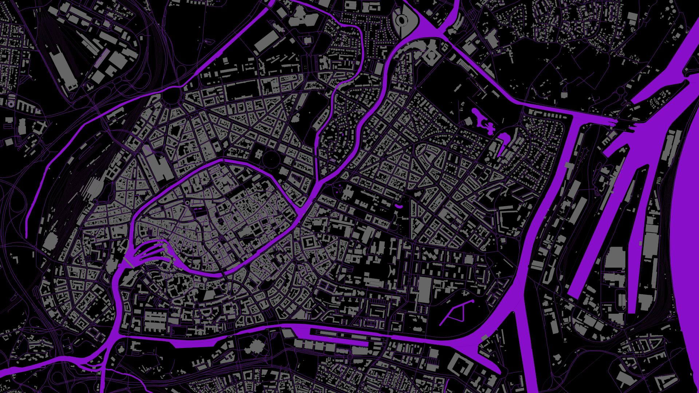

# schwarzplan



This is a super simple shell script to generate maps for the [French Pirate Party](https://partipirate.org/). It uses the [printmaps client](https://github.com/printmaps/printmaps) and the printmaps web service. It was done quickly and is provided to be tinkered with as-is and without warranty.

## Usage

To create a map, clone the repository and `cd` into it. Then run the script:

```
sh shwarzplan.sh latitude longitude scale name
```

The arguments describe:
- **latitude** and **longitude**, the center of the map in decimal degrees
- **scale**, the scale of the map as in 1:10000
- **name**, the file name of the map

### Example

To create the map shown above, run:

```
sh shwarzplan.sh 48.5845 7.7627 3000 strasbourg
```

### Results

The script generates 3 files:

- one vector version of the map in the SVG format
- two exported images of the map, in PNG and JPG